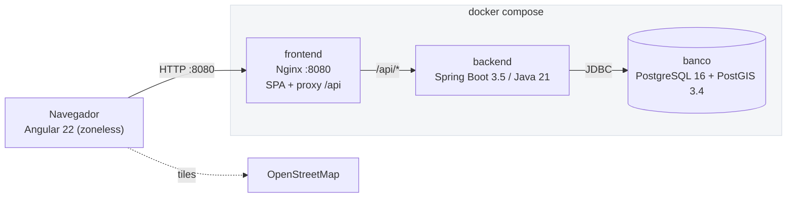
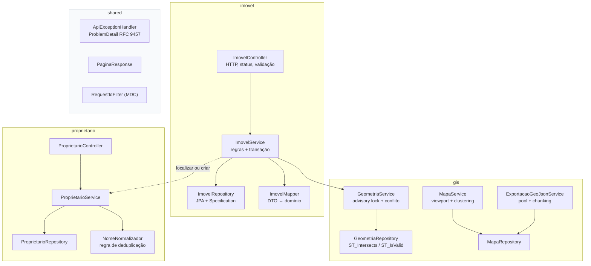
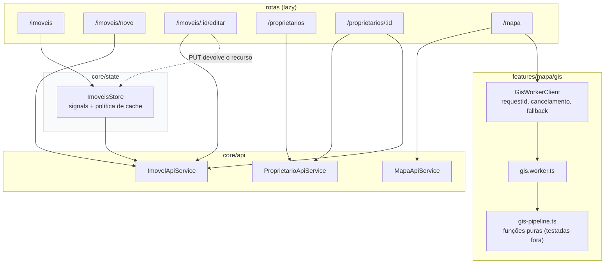
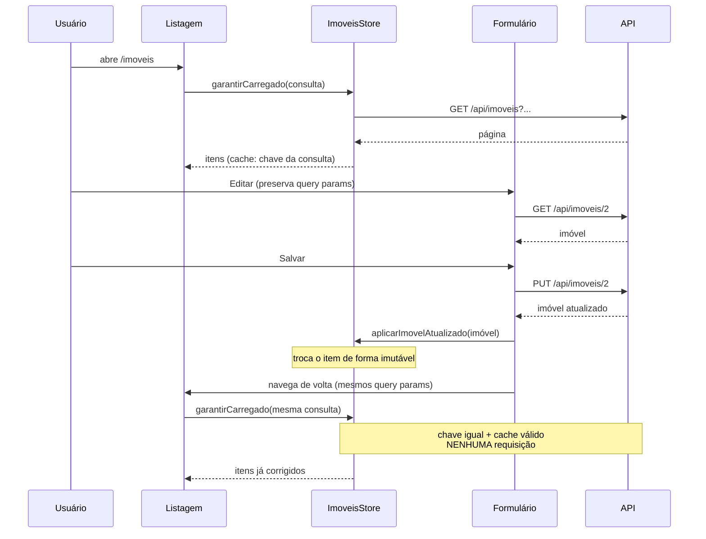
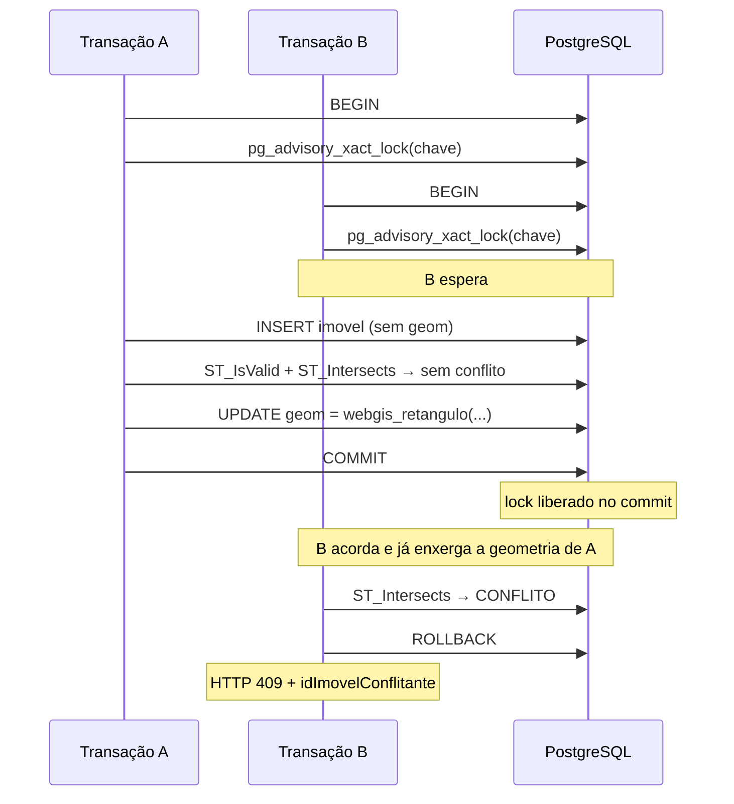
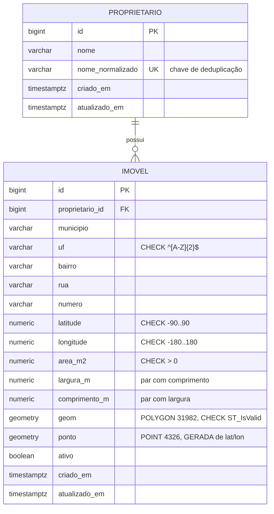

# Arquitetura

## Visão geral



Só a porta do frontend é publicada. Backend e banco existem apenas na rede
interna do compose — o banco não fica exposto no host.

## Backend — organização por funcionalidade



**Regra que orienta o corte:** o controller só traduz HTTP; o service concentra
regra e transação; o repository só sabe consultar. Nenhuma entidade JPA atravessa
a fronteira HTTP — entra e sai `record`.

### Estrutura de pastas (resumida)

```
backend/src/main/java/br/com/webgis/
├── imovel/            Imovel, Controller, Service, Repository, Mapper,
│   └── dto/           Specs, OrdenacaoImovel (whitelist)
├── proprietario/      entidade, CRUD, NomeNormalizador
│   └── dto/
├── gis/               geometria, mapa, GeoJSON
│   ├── dto/           Feicao, ColecaoDeFeicoes, propriedades seladas
│   └── worker/        pool GIS, exportação em lote, backpressure
└── shared/
    ├── config/        CORS por configuração
    ├── error/         exceções de domínio + ApiExceptionHandler
    └── web/           PaginaResponse, PaginacaoProperties, RequestIdFilter

backend/src/main/resources/db/migration/
├── V1__schema_inicial.sql       tabela imovel + CHECKs de domínio
├── V2__dados_legados.sql        12 imóveis com proprietário em TEXTO
├── V3__proprietario.sql         entidade + migração sem perda + FK
├── V4__indices_listagem.sql     pg_trgm, índices de filtro e ordenação
└── V5__postgis_geometria.sql    PostGIS, geom/ponto, GiST, webgis_retangulo
```

## Frontend — camadas



Nenhum componente injeta `HttpClient`. Toda URL vem de `APP_CONFIG` (`/api`),
resolvida por proxy — não há host literal no código.

## O fluxo que o requisito 3 exige



O teste `edicao-sem-novo-get.spec.ts` percorre exatamente esse caminho e prova
por `HttpTestingController` que nenhum GET da listagem foi emitido no retorno.

## Como a não sobreposição é garantida



Detalhe: o lock é `xact`, liberado automaticamente no commit **ou no rollback** —
não há caminho em que ele fique preso.

## Modelo de dados



`ponto` é coluna **gerada** a partir de latitude/longitude: não há como
dessincronizar do par de coordenadas, e ela sustenta o índice GiST usado pelo
mapa (imóveis legados não têm polígono).

## Onde cada requisito do enunciado foi resolvido

| Tarefa | Onde |
|--------|------|
| 1. Separar em duas páginas | rotas `/imoveis` e `/imoveis/novo` |
| 2. Filtros na listagem | `ImovelSpecs` + `ImovelFiltro` (servidor) |
| 3. Página de edição sem novo GET | `ImoveisStore` + `edicao-sem-novo-get.spec.ts` |
| 4. Proprietário como entidade | `V3__proprietario.sql` + `MigracaoProprietarioTest` |
| 5. Renomear refletindo em todos | FK; `ProprietarioService.renomear` |
| 6. Volume | paginação, índices `V4`, `docs/PERFORMANCE.md` |
| 7. Mapa | `MapaController` + `MapaComponent` (OpenLayers) |
| 8. Geometria sem sobreposição | `GeometriaService` + `V5` + `ConcorrenciaGeometriaTest` |
